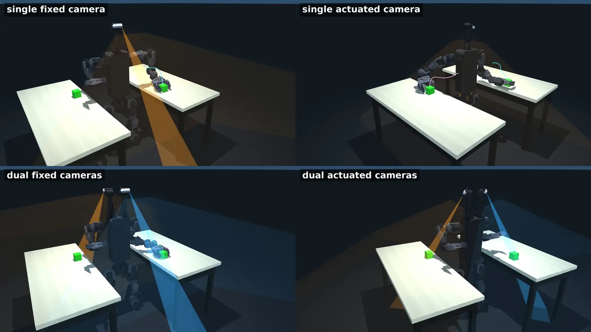
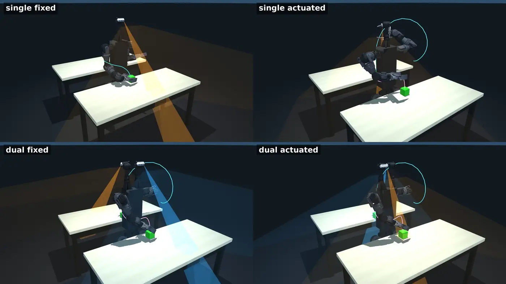

# Duke Humanoid V2

A 31-DoF quasi-direct-drive humanoid with two independently actuated yaw-pitch RGB-D
cameras, designed against the **visible-reachable workspace** (VRW): a design-stage measure
that conditions visibility on feasible reaching configurations, and extends it to
concurrent visibility of spatially separated work regions. Because the two optical axes are
not mechanically coupled, one camera can hold the current manipulation view while the other
is directed at a separate region.

[Simulation & training](https://github.com/generalroboticslab/duke_humanoid_v2_simulation) ·
[Onboard control stack](https://github.com/generalroboticslab/duke_humanoid_v2_deploy) ·
[Hardware](#hardware) · [Quick start](#quick-start)

<!-- Add [Paper] / [Project page] / [Video] to the row above once the arXiv preprint is posted. -->


Two moving targets held by two people on opposite sides, one camera module tracking each.


Targets left and right, both within reach. The two cameras observe the separated targets
and both arms reach without torso reorientation. Four trials playing together.


Targets in front and behind, the region a single forward-facing view cannot cover.


Targets left and right, too far to reach from the start stance: the robot observes both,
walks closer, then grasps.


The same walk-then-grasp with the targets in front and behind.


## Visible-reachable workspace

Workspace analysis measures where a robot can place its end effector. For visually guided
manipulation, reachability alone is insufficient: a target may be kinematically reachable
yet unavailable to the robot's cameras at the configurations that realize that reach. The
robot must then redirect its sensing or move its body to acquire a view, turning a
perception limitation into additional motion. Existing humanoids largely inherit this
limitation when copying human form factors, pairing broad arm workspaces with vision
concentrated in the head or the chest.

The **visible-reachable workspace** (VRW) is a design-stage measure that conditions
visibility on feasible reaching configurations. It starts from the conventional reachable
workspace and retains only targets that can also be observed from a feasible reaching
configuration.

The definition is task-dependent: joints required to realize the active manipulation are
distinguished from joints that remain independently available to aim cameras. A
wrist-mounted camera could be included in the visibility model, but on the reaching arm its
pose is coupled to the arm configuration used for the current reach, so it is not treated
as an independently steerable gaze degree of freedom. A camera gimbal that does not affect
the end-effector pose does contribute independent sensing actuation.

A pairwise extension, η₂, asks whether a layout can maintain concurrent views of a
manipulation target and a second spatially separated region.


The same arms and the same body, differing only in whether the camera joints are free.
Magenta is visible-reachable, blue is reachable but blind, and shade encodes the
orientation reachability index R. The blue volume is the cost the measure exists to expose:
space the arm can reach and the cameras cannot see.

## Camera configuration

We applied VRW to the sensing layout of the robot itself, evaluating six layouts: K = 1, 2
and 3 camera modules, each either actuated (Act) or fixed (Fix). Both single-target VRW
coverage and pairwise coverage η₂ were compared, with all other robot configuration held
the same.

**Mounting.** Cameras could be mounted on the front, back or top faces of the body. Front
and back were not chosen because their visual coverage is limited to one side of the
humanoid, whereas top-mounted cameras cover the front, back, left and right sides. Wrist
cameras were not considered: a wrist camera on the reaching arm offers no independent gaze
actuation under the partition above, and being end-effector mounted they complement body
cameras rather than substitute for them.

**Articulation over count.** Camera articulation had a larger effect on VRW coverage than
camera count. Across all camera counts, actuating the cameras greatly increased coverage,
from 38% to 97% on this robot. Once actuated, coverage was already close to saturation
with one camera module, and adding a second or third showed under 3% gains.

**Count for concurrency.** VRW coverage considers one manipulation target at a time. With
one camera, both regions must lie within the same unoccluded camera view, so η₂ decreased
as target separation increased. With two independently actuated cameras, each could
maintain a separate view and η₂ remained nearly constant with separation, rising from 0.45
to 0.95. A third camera raised it only to 0.97 while adding 0.58 kg, two gimbal DoF and
approximately \$600 in hardware cost. The design adopted K = 2 independently actuated
modules.


Colour encodes the orientation reachability index R, the fraction of 64 near-uniform SO(3)
orientations that admit a collision-free IK solution at each 20 mm grid point.


The same volumes as solids, one orbit each, under the same geometric evaluation. Magenta to
orange is visible-reachable, blue is reachable but blind.

Under the same geometric evaluation, the visible-reachable fraction ranges from 16% for the
fixed-head Unitree G1 to 48-76% for platforms with an actuated neck: PAL Talos, Booster T1,
Fourier GR-3 and Apptronik Apollo. All remain below this design on η₂, because their
cameras share the same neck joints and cannot aim independently at two separated regions.
GR-3 has the widest camera field of view among these platforms but still provides only one
viewing direction.

## Two-target reach-and-grasp benchmark

Actuated and fixed camera configurations (Act, Fix; K = 1, 2) were tested against the
Unitree G1 in six simulated two-target reach-and-grasp tasks. The robot had to locate and
grasp two objects placed to its left/right or front/back, either both on benches or one on
a bench and the other held by a human. Benches were close (0.20 m, objects within reach) or
far (0.8 m, requiring the robot to walk before reaching). A trial succeeded if both targets
were grasped. Completion time decomposes into search, approach and manipulation.

Success rates were similar across the five configurations, ranging from 0.967 to 0.994.
Compared with Fix₂, Act₂ reduced mean completion time by 17% and energy by 19%. At K = 1,
Act₁ reduced completion time by 24% and energy by 35% relative to Fix₁.

Camera actuation reduced search, approach and manipulation time alike. Act₂ reduced search
time by 50% relative to Fix₂, and Act₁ by 82% relative to Fix₁. The reduction came mainly
from locating targets through camera motion rather than walking until the targets became
visible. Approach time also fell, because far targets could be located before walking,
allowing the robot to walk directly toward the target rather than first toward the bench.

The second camera contributed differently. Act₁ and Act₂ had similar single-target
coverage; Act₂ had higher η₂ and could keep both targets in view for simultaneous reaching.
Camera configurations with higher visible-reachable and pairwise coverage reduced
completion time and energy while maintaining similar success rates.



The same scenario under all four configurations. Only Act₂ keeps both targets in view and
reaches both. Shaded cones are the camera fields of view.



The same four configurations with the benches in front and behind.

**Real-world deployment.** Act₂ was deployed on all four tabletop scenarios, shown at the
top of this page. The two cameras observed the separated front/back or left/right targets,
while the far scenarios additionally required the robot to walk closer before grasping.

Table IV has the full numbers, from 900 trials that reproduce from this release.

## Hardware


Orange numbers are actuated joints: (1-7) shoulder pitch/roll/yaw, elbow, wrist roll/pitch/yaw,
(8) waist, (9-14) hip pitch/roll/yaw, knee, ankle pitch/roll, (15-16) camera yaw/pitch. Green
labels are modules: (I) camera, (II) gripper, (III) onboard computer. Dimensions in mm.

| | |
| --- | --- |
| DoF | 31: 27-DoF body (waist ×1, legs 2×6, arms 2×7) + two 2-DoF camera gimbals, +1 per gripper |
| Mass / height | 36 kg / 1.2 m |
| Arm reach / leg length | 0.46 m / 0.39 m |
| Cameras | 2 × Intel RealSense D436, 90°×65° RGB FoV, 0.1-3.0 m, each on its own yaw-pitch gimbal |
| End effectors | parallel grippers, 350 g each, one mimic-coupled jaw slide |
| Actuation | quasi-direct-drive throughout |
| Control | 50 Hz learned whole-body policy onboard, 200 Hz CAN motor loop |

MJCF, meshes, camera modules, and gripper are in
[`simulation/asset/duke_v2/`](https://github.com/generalroboticslab/duke_humanoid_v2_simulation/tree/main/asset/duke_v2).

## Quick start

```bash
git clone --recurse-submodules git@github.com:generalroboticslab/duke_humanoid_v2.git
cd duke_humanoid_v2/simulation
pip install -r requirements.txt          # plus nvidia-curobo, see simulation/README.md
```

Regenerate the workspace figures. These read the shipped caches and finish in seconds,
without a GPU sweep or any training:

```bash
MUJOCO_GL=egl python mj_envs/asset_zoo/reachability_study/plot_workspace_curobo.py --reach-visible-compare
python mj_envs/asset_zoo/reachability_study/camera_count_ablation.py
```

Train the whole-body policy, or watch a shipped checkpoint:

```bash
python mj_envs/run.py train --task HumanoidRmaVelEstArmFlashSacv2ybsk_yaw_s4MixedArmsCam
python mj_envs/run.py play  --task HumanoidRmaVelEstArmFlashSacv2ybsk_yaw_s4MixedArmsCam
```

Everything needs an NVIDIA GPU. Full reproduction instructions, including the 900-trial
benchmark and the checkpoint provenance table, are in
[`simulation/README.md`](https://github.com/generalroboticslab/duke_humanoid_v2_simulation#readme).

## The two repositories

The split is between what runs in simulation and what runs on the robot. They are separate
repositories, not directories, so each keeps its own history and issue tracker. Training exports a policy; `deploy/` runs the export.

| | what it is |
| --- | --- |
| [`simulation/`](https://github.com/generalroboticslab/duke_humanoid_v2_simulation) | Policy training and the paper's reproduction package: the VRW study, the two-target reach-and-grasp benchmark, robot assets, and the checkpoints behind the reported numbers. |
| [`deploy/`](https://github.com/generalroboticslab/duke_humanoid_v2_deploy) | The onboard control stack: the 50 Hz policy loop, perception bridge, cuRobo planning client, gripper service, and the autonomous operator. |

Already cloned without the submodules:

```bash
git submodule update --init --recursive
```

## Running the hardware

Read [`deploy/control/docs/OPERATIONS.md`](https://github.com/generalroboticslab/duke_humanoid_v2_deploy/blob/main/control/docs/OPERATIONS.md)
first. That stack moves a 36 kg machine with people next to it, and its safety gates have
incidents behind them.
[`auto_operator_incidents.md`](https://github.com/generalroboticslab/duke_humanoid_v2_deploy/blob/main/control/docs/auto_operator_incidents.md)
lists each failure alongside the "simplification" that would bring it back.

## License

Apache-2.0, both repositories. Third-party robot models keep their upstream licenses
alongside their assets.
