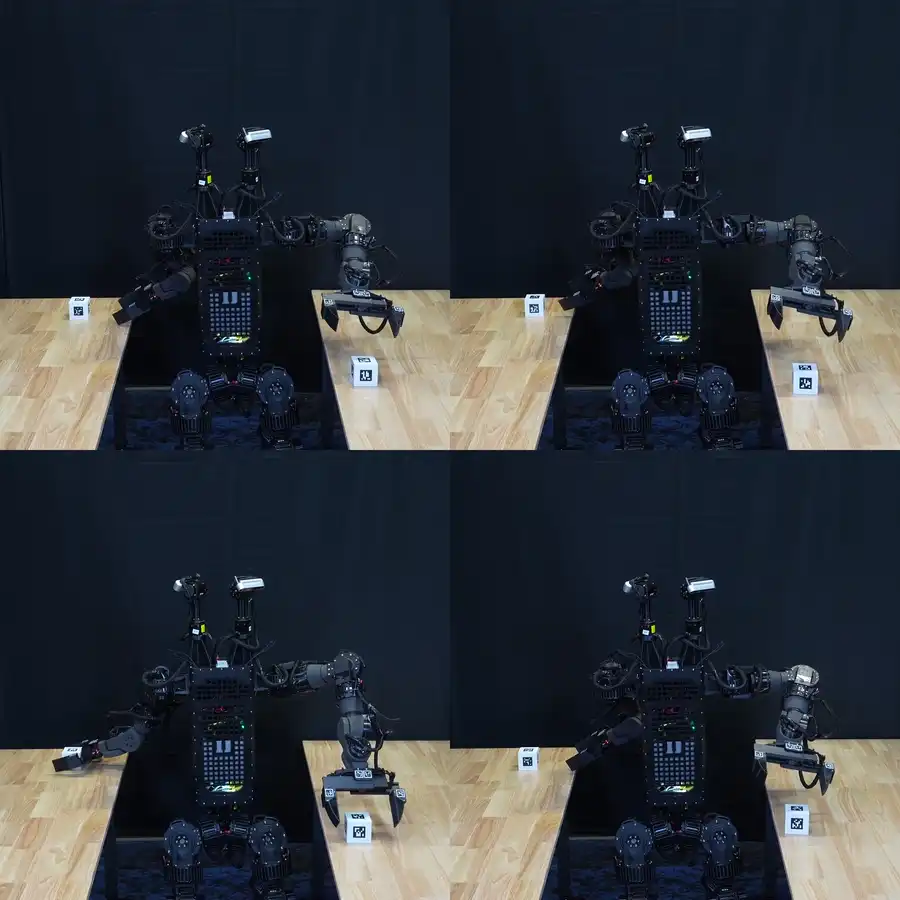
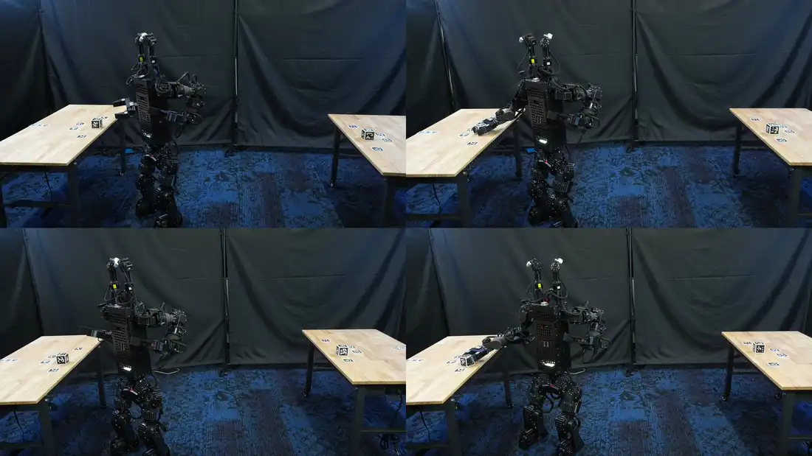
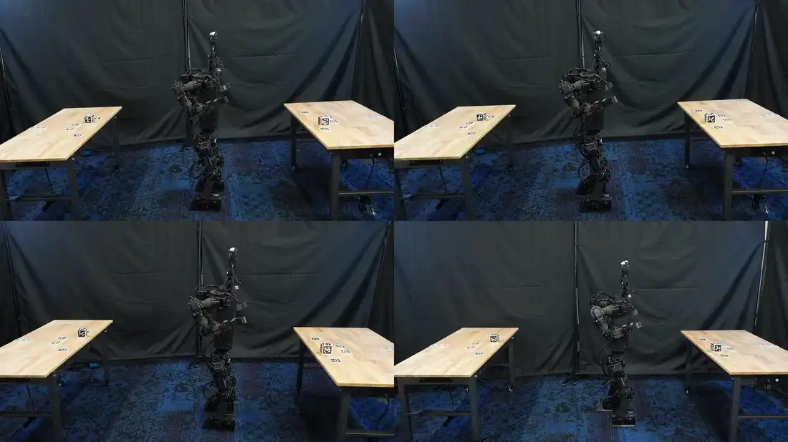
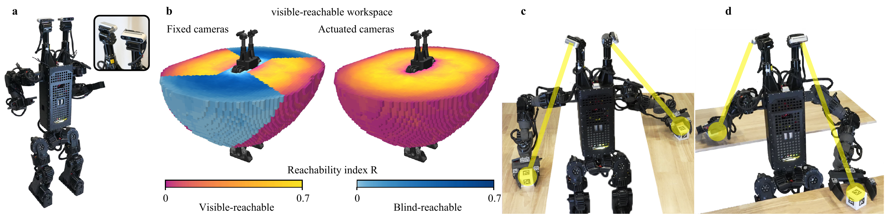
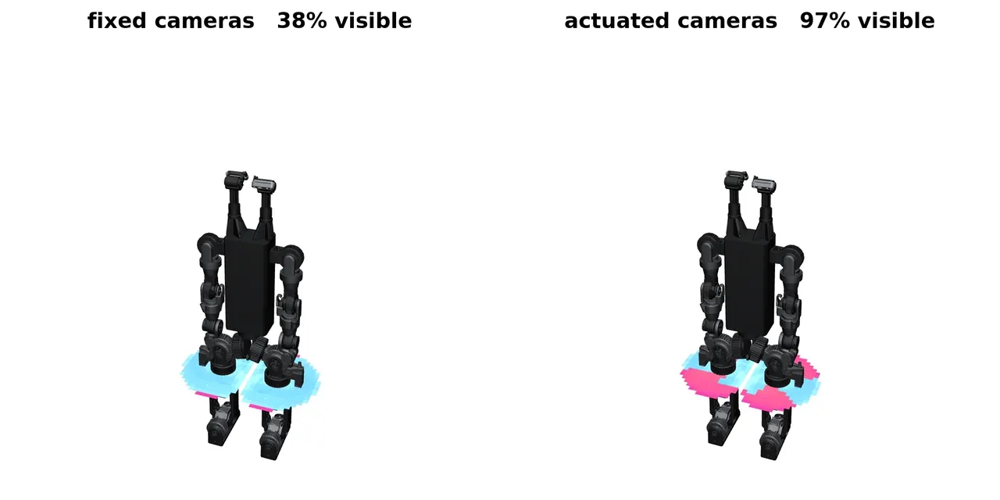
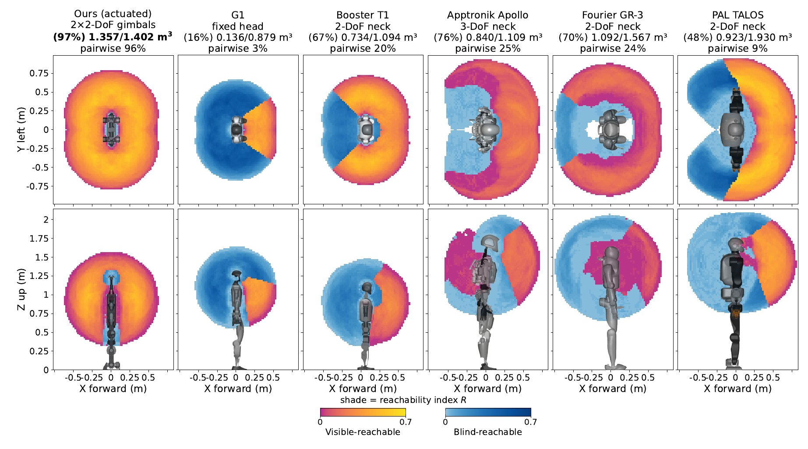
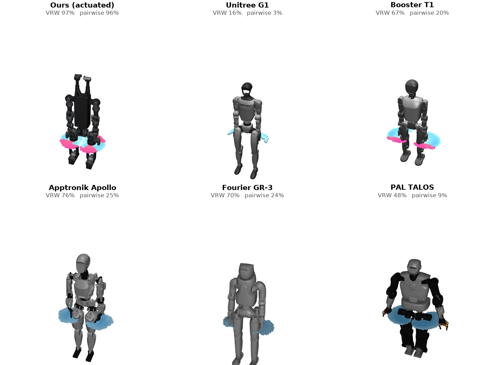
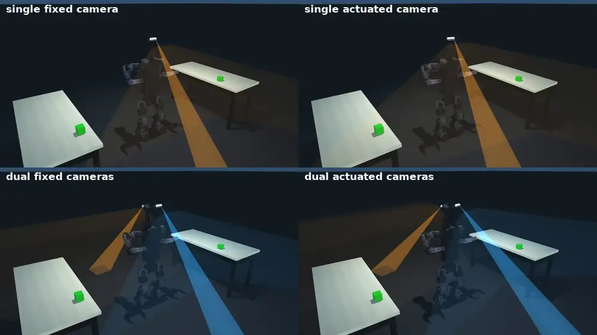
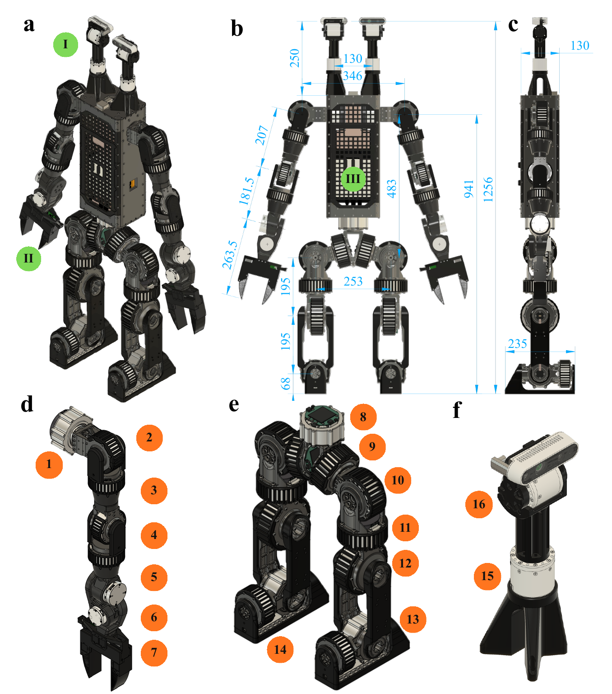

<div align="center">

# Duke Humanoid V2

**A 31-DoF humanoid whose two RGB-D cameras aim independently, designed around the
visible-reachable workspace.**

**Paper** (preprint coming) ·
**[Simulation &amp; training](https://github.com/generalroboticslab/duke_humanoid_v2_simulation)** ·
**[Onboard control stack](https://github.com/generalroboticslab/duke_humanoid_v2_deploy)** ·
**[Quick start](#quick-start)** ·
**[Hardware](#hardware)**

[](LICENSE)


</div>


<div align="center"><i>Two moving targets carried by two people on opposite sides. Each camera
module tracks one target and the arm on that side follows it, both at once.</i></div>

A humanoid can usually reach far more space than it can see. The **visible-reachable
workspace** (VRW) measures the part it can do both at once, and treats that overlap as a
design variable rather than an afterthought. Applying it to this robot's sensing layout is
what produced two independently aimed camera modules instead of a fixed head.

## Highlights

- **Articulation beats count.** Actuating the cameras raises visible-reachable coverage from 38%
  to 97%. A second and third module then add under 3%.
- **The second module buys concurrency.** Pairwise coverage η₂ rises from 0.45 to 0.95 and stays
  nearly constant as the two work regions separate, which one camera cannot do.
- **It shows up in the task.** Against a fixed two-camera layout, the actuated pair cuts mean
  completion time by 17% and energy by 19%, with search time halved and success unchanged.
- **It runs on hardware.** All four tabletop scenarios, plus dynamic tracking of two targets
  carried by two people.
- **It reproduces.** Every workspace figure regenerates from shipped caches in seconds, with no
  GPU sweep and no training.

## Contents

- [Real-world deployment](#real-world-deployment)
- [Quick start](#quick-start)
- [Visible-reachable workspace](#visible-reachable-workspace)
- [Camera configuration](#camera-configuration)
- [Two-target reach-and-grasp benchmark](#two-target-reach-and-grasp-benchmark)
- [Hardware](#hardware)
- [The two repositories](#the-two-repositories)
- [Running the hardware](#running-the-hardware)
- [Citation](#citation)

## Real-world deployment

Four trials play together in each clip.

<table>
<tr>
<td width="50%"></td>
<td width="50%"></td>
</tr>
<tr>
<td><b>Left and right, within reach.</b> The two cameras observe the separated targets and both
arms reach without torso reorientation.</td>
<td><b>Front and behind.</b> The region a single forward-facing view cannot cover.</td>
</tr>
<tr>
<td width="50%"></td>
<td width="50%"></td>
</tr>
<tr>
<td><b>Left and right, out of reach.</b> The robot observes both, walks closer, then grasps.</td>
<td><b>Front and behind, out of reach.</b> The same walk-then-grasp with the targets separated
along the other axis.</td>
</tr>
</table>



The same robot in simulation and on hardware. Act₂, the adopted configuration, was deployed on
all four tabletop scenarios above; the far ones required walking closer before grasping.

## Quick start

Everything in this section lives in the simulation repository, so clone that one alone.
The full project with both submodules is close to a gigabyte, most of it robot meshes and
recorded video:

```bash
git clone https://github.com/generalroboticslab/duke_humanoid_v2_simulation.git
cd duke_humanoid_v2_simulation

# A Python 3.12 environment, from nothing. Skip if you already have one.
"${SHELL}" <(curl -L micro.mamba.pm/install.sh)
micromamba create -n vrw python=3.12 -y && micromamba activate vrw
micromamba install -c conda-forge uv -y

uv pip install -r requirements.txt        # plus nvidia-curobo, see its README
```

Regenerate the workspace figures. These read the shipped caches and finish in seconds,
without a GPU sweep or any training:

```bash
MUJOCO_GL=egl python mj_envs/asset_zoo/reachability_study/plot_workspace_curobo.py --reach-visible-compare
python mj_envs/asset_zoo/reachability_study/camera_count_ablation.py
```

Train the whole-body policy, or watch a shipped checkpoint:

```bash
python mj_envs/run.py train --task HumanoidRmaVelEstArmFlashSacv2ybsk_yaw_s4MixedArmsCam
python mj_envs/run.py play  --task HumanoidRmaVelEstArmFlashSacv2ybsk_yaw_s4MixedArmsCam
```

Everything needs an NVIDIA GPU. Full reproduction instructions, including the 900-trial
benchmark and the checkpoint provenance table, are in
[`simulation/README.md`](https://github.com/generalroboticslab/duke_humanoid_v2_simulation#readme).

### Where each paper artifact lives

| Artifact | Repository | Cost to regenerate |
| --- | --- | --- |
| Fig. 2 cross-platform VRW, Fig. 5 camera count | `simulation` | seconds, shipped caches |
| Fig. 6 task keyframe grid | `simulation` | seconds, shipped frames |
| Table IV, 900-trial benchmark | `simulation` | hours, multi-GPU |
| Policy checkpoints, with md5 and training command per weight | `simulation` | shipped |
| Robot MJCF, meshes, camera modules, gripper | `simulation` | shipped |
| The 50 Hz onboard stack behind the hardware clips | `deploy` | not reproducible offline, needs the robot |

Only the benchmark needs a sweep. Every figure in the paper that this release covers
regenerates from data already in the repository.

To clone the whole project including the onboard stack:

```bash
git clone --recurse-submodules https://github.com/generalroboticslab/duke_humanoid_v2.git
```

## Visible-reachable workspace

Workspace analysis measures where a robot can place its end effector. For visually guided
manipulation, reachability alone is insufficient: a target may be kinematically reachable
yet unavailable to the robot's cameras at the configurations that realize that reach. The
robot must then redirect its sensing or move its body to acquire a view, turning a
perception limitation into additional motion. Existing humanoids largely inherit this
limitation when copying human form factors, pairing broad arm workspaces with vision
concentrated in the head or the chest.

The **visible-reachable workspace** (VRW) is a design-stage measure that conditions
visibility on feasible reaching configurations. It starts from the conventional reachable
workspace and retains only targets that can also be observed from a feasible reaching
configuration.

The definition is task-dependent: joints required to realize the active manipulation are
distinguished from joints that remain independently available to aim cameras. A
wrist-mounted camera could be included in the visibility model, but on the reaching arm its
pose is coupled to the arm configuration used for the current reach, so it is not treated
as an independently steerable gaze degree of freedom. A camera gimbal that does not affect
the end-effector pose does contribute independent sensing actuation.

A pairwise extension, η₂, asks whether a layout can maintain concurrent views of a
manipulation target and a second spatially separated region.



The same arms and the same body, differing only in whether the camera joints are free.
Magenta is visible-reachable, blue is reachable but blind, and shade encodes the
orientation reachability index R. The blue volume is the cost the measure exists to expose:
space the arm can reach and the cameras cannot see.

## Camera configuration

We applied VRW to the sensing layout of the robot itself, evaluating six layouts: K = 1, 2
and 3 camera modules, each either actuated (Act) or fixed (Fix). Both single-target VRW
coverage and pairwise coverage η₂ were compared, with all other robot configuration held
the same.

**Mounting.** Cameras could be mounted on the front, back or top faces of the body. Front
and back were not chosen because their visual coverage is limited to one side of the
humanoid, whereas top-mounted cameras cover the front, back, left and right sides. Wrist
cameras were not considered: a wrist camera on the reaching arm offers no independent gaze
actuation under the partition above, and being end-effector mounted they complement body
cameras rather than substitute for them.

**Articulation over count.** Camera articulation had a larger effect on VRW coverage than
camera count. Across all camera counts, actuating the cameras greatly increased coverage,
from 38% to 97% on this robot. Once actuated, coverage was already close to saturation
with one camera module, and adding a second or third showed under 3% gains.

**Count for concurrency.** VRW coverage considers one manipulation target at a time. With
one camera, both regions must lie within the same unoccluded camera view, so η₂ decreased
as target separation increased. With two independently actuated cameras, each could
maintain a separate view and η₂ remained nearly constant with separation, rising from 0.45
to 0.95. A third camera raised it only to 0.97 while adding 0.58 kg, two gimbal DoF and
approximately \$600 in hardware cost. The design adopted K = 2 independently actuated
modules.



Colour encodes the orientation reachability index R, the fraction of 64 near-uniform SO(3)
orientations that admit a collision-free IK solution at each 20 mm grid point.



The same volumes as solids, one sweep each, every platform shown from its own front. Magenta to
orange is visible-reachable, blue is reachable but blind.

| Platform | Camera modules | Independently aimable | Visible-reachable | Scalar η₂ |
| --- | ---: | ---: | ---: | ---: |
| **Ours, actuated** | 2 | **2** | **97%** | **0.96** |
| Apptronik Apollo | 2 | 1 | 76% | 0.25 |
| Fourier GR-3 | 1 | 1 | 70% | 0.24 |
| Booster T1 | 1 | 1 | 67% | 0.20 |
| PAL Talos | 1 | 1 | 48% | 0.09 |
| Unitree G1 | 1 | 0 | 16% | 0.03 |
| *Ours, cameras welded* | *2* | *0* | *38%* | *0.14* |

The last row is the same robot with its camera joints frozen, which is the controlled
comparison: the body and the arms are identical and coverage still falls from 97% to 38%.

Under the same geometric evaluation, the visible-reachable fraction ranges from 16% for the
fixed-head Unitree G1 to 48-76% for platforms with an actuated neck. All remain below this
design on η₂, because their cameras share the same neck joints and cannot aim independently
at two separated regions. GR-3 has the widest camera field of view among these platforms but
still provides only one viewing direction.

η₂ is distribution-dependent and is descriptive context across platforms, not a universal
ranking; the controlled comparison is the camera-count study above, which evaluates every
layout on one robot and one grid.

## Two-target reach-and-grasp benchmark

Actuated and fixed camera configurations (Act, Fix; K = 1, 2) were tested against the
Unitree G1 in six simulated two-target reach-and-grasp tasks. The robot had to locate and
grasp two objects placed to its left/right or front/back, either both on benches or one on
a bench and the other held by a human. Benches were close (0.20 m, objects within reach) or
far (0.8 m, requiring the robot to walk before reaching). A trial succeeded if both targets
were grasped. Completion time decomposes into search, approach and manipulation.

Averaged over the six scenarios, 900 trials, success-conditional means. Lower is better
throughout. Act₂ is the adopted configuration.

| | Time T̄ (s) | Search (s) | Approach (s) | Manipulation (s) | Energy (J) |
| --- | ---: | ---: | ---: | ---: | ---: |
| Unitree G1 | 27.5 | 3.8 | 3.8 | 19.9 | 494 |
| Fix₂ | 17.0 | 0.2 | 3.2 | 13.6 | 425 |
| **Act₂ (ours)** | **14.1** | **0.1** | **2.1** | **11.9** | **346** |
| Fix₁ | 20.5 | 3.3 | 3.3 | 13.9 | 595 |
| Act₁ | 15.5 | 0.6 | 2.7 | 12.2 | 385 |

Act₂ is best on every metric in the mean. Success rate does not separate the five
configurations (0.967 to 0.994), so time and energy carry the comparison. Against Fix₂, Act₂
cut completion time 17% and energy 19%; at K = 1, Act₁ cut them 24% and 35% relative to Fix₁.

Camera actuation reduced search, approach and manipulation time alike. The search column is
where it shows most: Act₂ reduced search time by 50% relative to Fix₂, and Act₁ by 82%
relative to Fix₁, mainly by locating targets through camera motion rather than walking until
the targets became visible. Approach time also fell, because far targets could be located
before walking, allowing the robot to walk directly toward the target rather than first
toward the bench.

The second camera contributed differently. Act₁ and Act₂ had similar single-target
coverage; Act₂ had higher η₂ and could keep both targets in view for simultaneous reaching.
Camera configurations with higher visible-reachable and pairwise coverage reduced
completion time and energy while maintaining similar success rates.

The per-scenario breakdown is Table IV in the paper, and the whole sweep reproduces from
[`dyn_sweep.py`](https://github.com/generalroboticslab/duke_humanoid_v2_simulation#two-target-reach-and-grasp-benchmark-table-iv).

All six scenarios below, each under all four camera configurations. Shaded cones are the camera
fields of view.

<table>
<tr>
<td width="50%"></td>
<td width="50%"></td>
</tr>
<tr>
<td><b>Left/right, close.</b> Both targets within reach. Only the actuated pair keeps both in
view and reaches both.</td>
<td><b>Front/back, close.</b> The separation a single forward view cannot span.</td>
</tr>
<tr>
<td width="50%"></td>
<td width="50%"></td>
</tr>
<tr>
<td><b>Left/right, far.</b> Benches at 0.8 m, so the robot walks before reaching.</td>
<td><b>Front/back, far.</b> Locating a target before walking is what shortens the approach.</td>
</tr>
<tr>
<td width="50%"></td>
<td width="50%"></td>
</tr>
<tr>
<td><b>Handoff, left/right.</b> One target on a bench, the other held by a human.</td>
<td><b>Handoff, front/back.</b> The same mix with the two regions separated fore and aft.</td>
</tr>
</table>

## Hardware



Orange numbers are actuated joints: (1-7) shoulder pitch/roll/yaw, elbow, wrist roll/pitch/yaw,
(8) waist, (9-14) hip pitch/roll/yaw, knee, ankle pitch/roll, (15-16) camera yaw/pitch. Green
labels are modules: (I) camera, (II) gripper, (III) onboard computer. Dimensions in mm.

| | |
| --- | --- |
| DoF | 31: 27-DoF body (waist ×1, legs 2×6, arms 2×7) + two 2-DoF camera gimbals, +1 per gripper |
| Mass / height | 36 kg / 1.2 m |
| Arm reach / leg length | 0.46 m / 0.39 m |
| Cameras | 2 × Intel RealSense D436, 90°×65° RGB FoV, 0.1-3.0 m, each on its own yaw-pitch gimbal |
| End effectors | parallel grippers, 350 g each, one mimic-coupled jaw slide |
| Actuation | quasi-direct-drive throughout |
| Control | 50 Hz learned whole-body policy onboard, 200 Hz CAN motor loop |

MJCF, meshes, camera modules, and gripper are in
[`simulation/asset/duke_v2/`](https://github.com/generalroboticslab/duke_humanoid_v2_simulation/tree/main/asset/duke_v2).

## The two repositories

The split is between what runs in simulation and what runs on the robot. They are separate
repositories, not directories, so each keeps its own history and issue tracker. Training exports a policy; `deploy/` runs the export.

| | what it is |
| --- | --- |
| [`simulation/`](https://github.com/generalroboticslab/duke_humanoid_v2_simulation) | Policy training and the paper's reproduction package: the VRW study, the two-target reach-and-grasp benchmark, robot assets, and the checkpoints behind the reported numbers. |
| [`deploy/`](https://github.com/generalroboticslab/duke_humanoid_v2_deploy) | The onboard control stack: the 50 Hz policy loop, perception bridge, cuRobo planning client, gripper service, and the autonomous operator. |

Already cloned without the submodules:

```bash
git submodule update --init --recursive
```

## Running the hardware

Read [`deploy/control/docs/OPERATIONS.md`](https://github.com/generalroboticslab/duke_humanoid_v2_deploy/blob/main/control/docs/OPERATIONS.md)
first. That stack moves a 36 kg machine with people next to it, and its safety gates have
incidents behind them.
[`auto_operator_incidents.md`](https://github.com/generalroboticslab/duke_humanoid_v2_deploy/blob/main/control/docs/auto_operator_incidents.md)
lists each failure alongside the "simplification" that would bring it back.

## Citation

The preprint is not posted yet. When it is, this block and the link row at the top will carry the
reference.

```bibtex
@misc{duke_humanoid_v2,
  title  = {Visible-Reachable Workspace for Perception-Aware Humanoid Design},
  author = {Boxi Xia and Zijiang Yang and Ryan Shin and Bokuan Li and Eric Lu and Jacob Lee and Jiaxun Liu and Boyuan Chen},
  year   = {2026},
  url    = {https://github.com/generalroboticslab/duke_humanoid_v2}
}
```

## Acknowledgements

The comparison platforms in the VRW study are third-party models, redistributed under their
own licenses in `simulation/asset/<platform>/`. Each keeps its upstream `LICENSE` beside its
meshes.

| Platform | Source | License |
| --- | --- | --- |
| Unitree G1 | [mjlab](https://github.com/mujocolab/mjlab), which carries the [MuJoCo Menagerie](https://github.com/google-deepmind/mujoco_menagerie) model | see mjlab; only cuRobo URDF exports are vendored here |
| Booster T1 | MuJoCo Menagerie | Apache-2.0 |
| Apptronik Apollo | MuJoCo Menagerie | Apache-2.0 |
| PAL Talos | MuJoCo Menagerie | Apache-2.0 |
| Fourier GR-3 | [Fourier GRx](https://github.com/FFTAI) | **GPL-3.0** |
| ToddlerBot | upstream ToddlerBot release | MIT |

**The Fourier GR-3 model is GPL-3.0**, not Apache-2.0 like the rest of this release. If that
matters for your use, drop `simulation/asset/fourier_gr3/`; it is a comparison column in the
workspace figures and nothing else depends on it.

The study and the benchmark are built on [MuJoCo](https://github.com/google-deepmind/mujoco),
[mjlab](https://github.com/mujocolab/mjlab), MuJoCo Warp, and
[cuRobo](https://github.com/NVlabs/curobo) for collision-free IK and motion planning.

## License

Apache-2.0 for the code in all three repositories, see [`LICENSE`](LICENSE). Third-party
robot models keep their upstream licenses alongside their assets, listed above.
