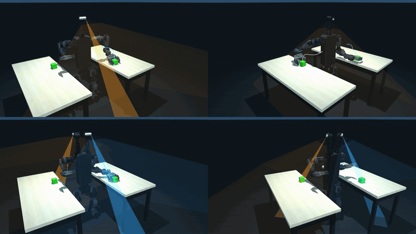
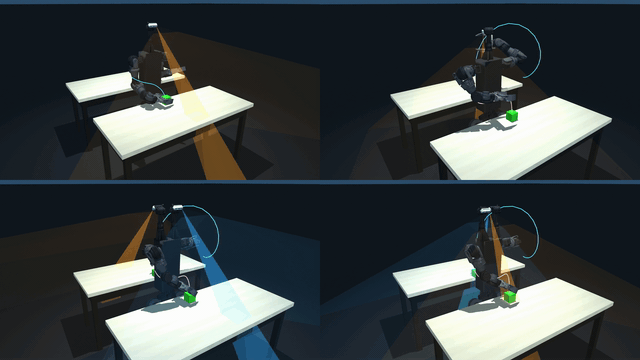

# Duke Humanoid V2

A 31-DoF quasi-direct-drive humanoid with two independently actuated yaw-pitch RGB-D
cameras. Each camera aims at its own work region, so the robot can watch two separated
places at once without reorienting its torso.

[Simulation & training](https://github.com/generalroboticslab/duke_humanoid_v2_simulation) ·
[Onboard control stack](https://github.com/generalroboticslab/duke_humanoid_v2_deploy) ·
[Hardware](#hardware) · [Quick start](#quick-start)

<!-- Add [Paper] / [Project page] / [Video] to the row above once the arXiv preprint is posted. -->




One green cube on each of two tables, and the same mission run by four builds of the same
robot. Top row has one camera, bottom row has two. Left column has them welded to the
body, right column has them on gimbals. Only the bottom right, two cameras and actuated,
holds both cubes in view while both arms reach. The cones are the fields of view, cyan for
the left module and orange for the right.

Same four builds, with the tables in front and behind instead of left and right:



## Why the cameras move

Reachability tells you where the arm can put the end effector. It does not tell you
whether the robot can see the target once it gets there. A target can sit well inside the
arm workspace and still fall outside every camera view at the configurations that actually
realize the reach. Humanoids inherit this from the human form factor: broad arm
workspaces, vision concentrated in the head or the chest.

The cost does not stay in the perception system. To acquire a view, the robot redirects a
camera, rotates its torso, or walks to a new viewpoint. When the eyes cannot acquire the
workspace, the body moves instead, so a limitation that looks perceptual at design time
becomes whole-body motion at execution time.

The **visible-reachable workspace** (VRW) measures that coupling. Start from the reachable
workspace, then keep only the targets that can also be observed from a configuration that
reaches them. How the joints are partitioned is the part that matters: joints spent
realizing the reach do not count as gaze actuation. A wrist camera on the reaching arm is
therefore not an independent view, while a gimbal that leaves the end-effector pose alone
is.

## What the measure decided

The sensing layout is an output of the analysis rather than an assumption going in.

**Top of the body, not the front or back faces.** A front- or back-mounted camera covers
one side of the robot. Mounted on top, it reaches front, back, left, and right.

**No wrist cameras.** On the reaching arm, a wrist camera contributes no independent gaze
actuation under the partition above. Wrist cameras complement body cameras; they do not
substitute for them.

**Articulation, then count.** These fix two different problems, and conflating them is
easy. Across every camera count, articulation is what drives single-target coverage: 38%
to 97% on this robot. Once actuated, a single module is already near saturation, and a
second or third adds under 3%.

**Count is for two regions at once.** Single-target coverage says nothing about viewing
two places simultaneously. With one camera, both regions have to fall inside the same
unoccluded view, so pairwise coverage falls off as the targets separate. With two
independently actuated cameras, each holds its own view and pairwise coverage stays nearly
flat with separation: 0.45 to 0.95. A third reaches 0.97, for 0.58 kg, two more gimbal
DoF, and about \$600. Hence two modules.


Evaluated the same way, other humanoids run from 16% visible-reachable coverage for the
fixed-head Unitree G1 to 48-76% for the actuated-neck platforms: PAL Talos, Booster T1,
Fourier GR-3, Apptronik Apollo. All of them fall below this design on pairwise coverage,
because their cameras share the same neck joints. However wide or steerable that view is,
it is still one viewing direction. GR-3 has the widest field of view in the group and
scores lower for exactly this reason.

## What it buys

Across six two-target scenarios, all five camera configurations succeed about equally
often. The question is not whether the robot gets both cubes. It is what it spends getting
them.

Freeing the cameras is what pays. The same robot with the same weights finishes about 17%
faster and with 19% less mechanical work when its two cameras can aim than when they are
welded. With one camera the gap is wider still, because a single welded camera can look
nowhere except where the body already points.

Almost all of that saving is walking that no longer happens. A fixed-camera robot finds a
target the only way it can: rotate the body, or walk toward the region until the target
comes into view. An actuated one turns its cameras and stays put, which is where most of
the search time goes. Approach time drops for a related reason. A far target can be
located before the walk begins, so the robot walks at the cube instead of walking at the
table and correcting once it arrives.

The second camera does something different from actuation, and the two are easy to
confuse. One actuated camera already sees nearly as much of the reachable space as two do.
What the second one buys is holding both targets at the same time, so the planner reaches
for them together instead of one after the other.

On hardware, the robot ran all four tabletop scenarios, front/back and left/right, near
and far, observing both targets without turning to look between them.

Exact numbers are Table IV of the paper. The benchmark behind them is 6 scenarios × 3
repeats × 10 seeded layouts, 900 trials, and it reproduces from this release.

## Hardware


Orange numbers are actuated joints: (1-7) shoulder pitch/roll/yaw, elbow, wrist roll/pitch/yaw,
(8) waist, (9-14) hip pitch/roll/yaw, knee, ankle pitch/roll, (15-16) camera yaw/pitch. Green
labels are modules: (I) camera, (II) gripper, (III) onboard computer. Dimensions in mm.

| | |
| --- | --- |
| DoF | 31: 27-DoF body (waist ×1, legs 2×6, arms 2×7) + two 2-DoF camera gimbals, +1 per gripper |
| Mass / height | 36 kg / 1.2 m |
| Arm reach / leg length | 0.46 m / 0.39 m |
| Cameras | 2 × Intel RealSense D436, 90°×65° RGB FoV, 0.1-3.0 m, each on its own yaw-pitch gimbal |
| End effectors | parallel grippers, 324 g each, one mimic-coupled jaw slide |
| Actuation | quasi-direct-drive throughout |
| Control | 50 Hz learned whole-body policy onboard, 244 Hz CAN motor loop |

MJCF, meshes, camera modules, and gripper are in
[`simulation/asset/duke_v2/`](https://github.com/generalroboticslab/duke_humanoid_v2_simulation/tree/main/asset/duke_v2).

## Quick start

```bash
git clone --recurse-submodules git@github.com:generalroboticslab/duke_humanoid_v2.git
cd duke_humanoid_v2/simulation
pip install -r requirements.txt          # plus nvidia-curobo, see simulation/README.md
```

Regenerate the workspace figures. These read the shipped caches and finish in seconds,
without a GPU sweep or any training:

```bash
MUJOCO_GL=egl python mj_envs/asset_zoo/reachability_study/plot_workspace_curobo.py --reach-visible-compare
python mj_envs/asset_zoo/reachability_study/camera_count_ablation.py
```

Train the whole-body policy, or watch a shipped checkpoint:

```bash
python mj_envs/run.py train --task HumanoidRmaVelEstArmFlashSacv2ybsk_yaw_s4MixedArmsCam
python mj_envs/run.py play  --task HumanoidRmaVelEstArmFlashSacv2ybsk_yaw_s4MixedArmsCam
```

Everything needs an NVIDIA GPU. Full reproduction instructions, including the 900-trial
benchmark and the checkpoint provenance table, are in
[`simulation/README.md`](https://github.com/generalroboticslab/duke_humanoid_v2_simulation#readme).

## The two repositories

The split is between what runs in simulation and what runs on the robot. They are separate
repositories, not directories, so each keeps its own history and issue tracker. Training exports a policy; `deploy/` runs the export.

| | what it is |
| --- | --- |
| [`simulation/`](https://github.com/generalroboticslab/duke_humanoid_v2_simulation) | Policy training and the paper's reproduction package: the VRW study, the two-target reach-and-grasp benchmark, robot assets, and the checkpoints behind the reported numbers. |
| [`deploy/`](https://github.com/generalroboticslab/duke_humanoid_v2_deploy) | The onboard control stack: the 50 Hz policy loop, perception bridge, cuRobo planning client, gripper service, and the autonomous operator. |

Already cloned without the submodules:

```bash
git submodule update --init --recursive
```

## Running the hardware

Read [`deploy/control/docs/OPERATIONS.md`](https://github.com/generalroboticslab/duke_humanoid_v2_deploy/blob/main/control/docs/OPERATIONS.md)
first. That stack moves a 36 kg machine with people next to it, and its safety gates have
incidents behind them.
[`auto_operator_incidents.md`](https://github.com/generalroboticslab/duke_humanoid_v2_deploy/blob/main/control/docs/auto_operator_incidents.md)
lists each failure alongside the "simplification" that would bring it back.

## License

Apache-2.0, both repositories. Third-party robot models keep their upstream licenses
alongside their assets.
